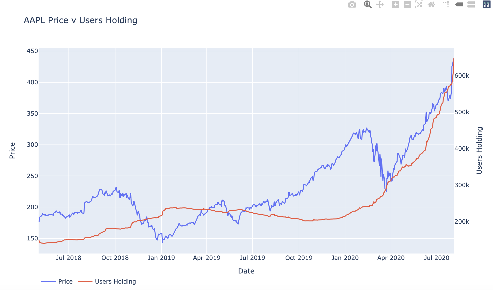

# Robintrack Data with Prices

The robintrack.net dataset can be downloaded [here](https://robintrack.net/data-download). The dataset tracks the number of Robinhood users holding a particular stock. However, the dataset does not include prices. In the following notebook I add prices to the data via Yahoo Finance. There are 8000+ stocks available to trade on Robinhood. Not all of those prices are available on Yahoo Finance, but a majority are. If you find a better option for pricing data other than the Robinhood API please let me know. If you find an interesting patterns in the data please let me know.

The entire notebook takes around 2 to 3 hours to run with the bulk of the time allocated to downloading prices from Yahoo Finance.

# Fetch Pricing Data from Yahoo Finance

The start date is the earliest date that robintrack.net began collecting data. Don't forget to change the end date to the most recent trading day. You can change the stock list to be a small list of stocks of your choosing, but I like to look at the dataset as a whole. You can also get more data from Yahoo Finance, but I just chose to get the close and volume figures.

# Recreate the robintrack.net graphs
Note: these graphs aren't exactly the same because robintrack.net collects multiple price points a day and we've only gathered closing prices.

